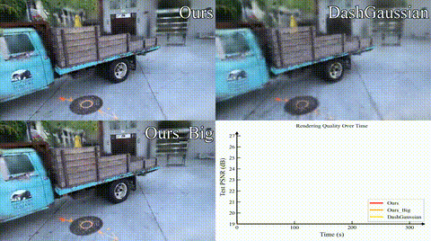








I am currently a first-year Ph.D. student at [NKU](https://www.nankai.edu.cn/). I am supervised by [Yongchun Fang](https://nankai.teacher.360eol.com/teacherBasic/preview?teacherId=10244). Previously, I obtained my B.Eng. degree at [AI](https://ai.nankai.edu.cn/) of Nankai University in 2025. 

My research interest lies in the field of 3D Computer Vision, particularly feed-forward reconstruction.

# 🔥 News
- 2025.11: our paper [FastGS](https://fastgs.github.io/) was released.
- 2025.06: 🎓 Graduated from Nankai University.

# 📝 Publications 

(†: corresponding author; * :equal contribution)

<!-- FastGS -->

Arxiv 2025

**FastGS: Training 3D Gaussian Splatting in 100 Seconds**

**Shiwei Ren\***,
[Tianci Wen*](https://tianci-wen.github.io/),
[Yongchun Fang†](https://nankai.teacher.360eol.com/teacherBasic/preview?teacherId=10244),
[Biao Lu](https://ai.nankai.edu.cn/info/1034/5388.htm)

[[**Project**]](https://fastgs.github.io/)&nbsp;
[[**Paper**]](https://arxiv.org/abs/2511.04283)&nbsp;
[[**Code**]](https://github.com/fastgs/FastGS)

<!-- FastGS -->

# 🎖 Honors and Awards
- *2024* Nankai University Gongneng Scholarship  
- *2024* Nankai University “Sanhao Student” (Excellent Student Award)  
- *2022* Nankai University Academic Excellence Scholarship

# 📖 Educations
- Ph.D. in Artificial Intelligence, Nankai University, 2025.09 – present
- B.S. in Intelligent Science and Technology, Nankai University, 2021.09 – 2025.06

<!-- # 💬 Invited Talks
- *2021.06*, Lorem ipsum dolor sit amet, consectetur adipiscing elit. Vivamus ornare aliquet ipsum, ac tempus justo dapibus sit amet. 
- *2021.03*, Lorem ipsum dolor sit amet, consectetur adipiscing elit. Vivamus ornare aliquet ipsum, ac tempus justo dapibus sit amet.  \| [\[video\]](https://github.com/) -->

<!-- # 💻 Internships
- *2019.05 - 2020.02*, [Lorem](https://github.com/), China. -->